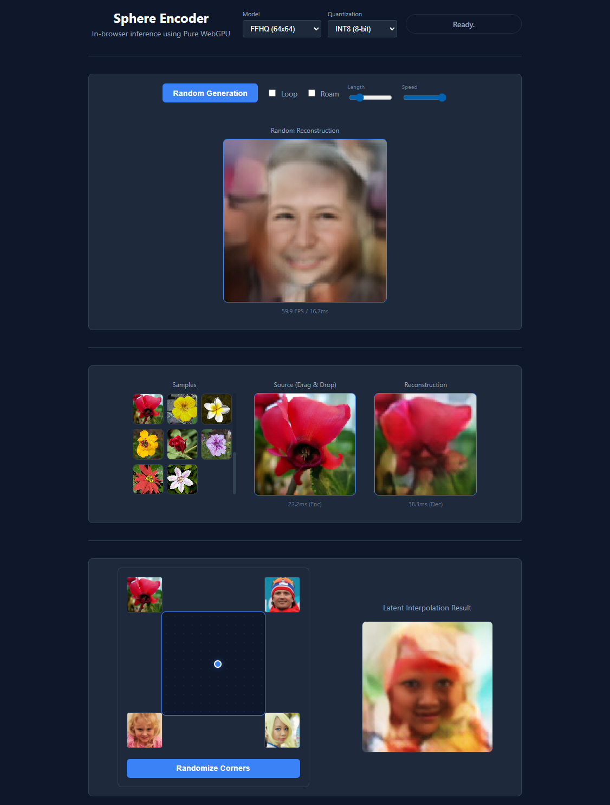
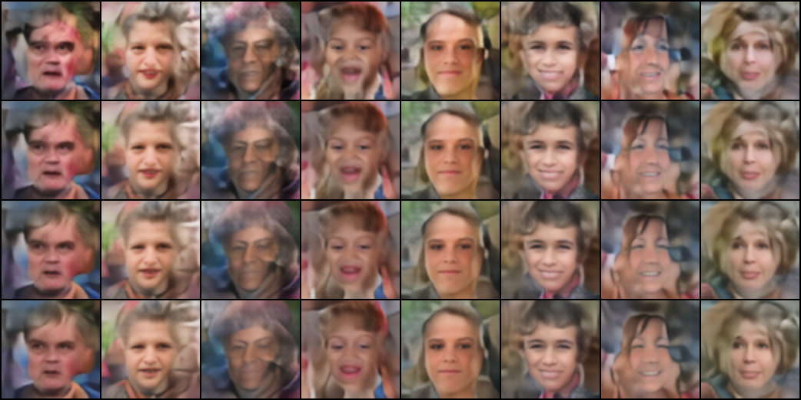

# Sphere Encoder

Unofficial implementation of **[Image Generation with a Sphere Encoder](https://arxiv.org/abs/2602.15030)**.

**Official project page** and code (when available): https://sphere-encoder.github.io/

    The Sphere Encoder is an efficient generative framework that produces high-quality images in a single forward pass. Unlike diffusion models that require many iterations, the Sphere Encoder maps images onto a spherical latent space and learns to decode them back. It achieves performance competitive with state-of-the-art diffusion models in as few as 1 to 4 steps.

**try it out here:
[LIVE DEMO ](https://barradeau.com/2026/sphere-encoder/)**


It uses a CIFAR10 trained for 285 epochs (batch 256, 200 steps per epoch) and a 64x64 FFHQ trained for 600 epochs (batch 128, 200 steps per epoch)
each model has 4 quantization level (fp32 (original), fp16, int8, int4)

**WARNING**: the project was made using Gemini, some important features, especially the latent dimension computation and multi-step reconstruction may be plain wrong, better wait for the official implementation :)


## Training

### Datasets
You can download and prepare small datasets them using the provided utility scripts.

#### CIFAR-10 (10K 32*32 images)
Automatically downloads and extracts the CIFAR-10 dataset using `torchvision`.
```bash
python download_cifar.py
```

#### FFHQ (70K 64*64 images)
Downloads the FFHQ (64x64) dataset from Hugging Face and prepares it for training.
```bash
python download_faces.py
```


The `training.py` script handles the training process for the Sphere Encoder. It supports both ConvNet and ViT architectures.
Vit is slower and consumes more GPU memory but should achieve better quality, the default is ConvNet.

### Functional Details
- **Losses**: Combines Pixel L1 loss, Perceptual Loss (VGG), and Latent Consistency loss.
- **Latent Space**: Projects embeddings onto a sphere with radius $\sqrt{L}$ (where $L$ is the latent dimension).
- **Multistep**: Supports the multi-step training logic described in the paper to enhance reconstruction quality.

### Arguments
| Argument | Type | Default | Description |
| :--- | :--- | :--- | :--- |
| `--dataset` | `str` | `cifar10` | Dataset name or path to image folder |
| `--batch_size` | `int` | `128` | Training batch size |
| `--epochs` | `int` | `1000` | Number of training epochs |
| `--steps` | `int` | `200` | Number of step per epoch |
| `--lr` | `float` | `1e-3` | Learning rate |
| `--latent_dim` | `int` | `2048` | Dimension of the spherical latent space |
| `--image_size` | `int` | `32` | Resolution of input/output images |
| `--model_type` | `str` | `convnet` | Model architecture: `convnet` or `vit` |
| `--sigma_max` | `float` | `0.2` | Maximum noise level for training |

other useful flags to monitor training progress:

| Argument | Type | Default | Description |
| :--- | :--- | :--- | :--- |
| `--eval-frequency` | `int` | `100` | Evaluation frequency (in epochs) renders a batch of images |
| `--checkpoint-frequency` | `int` | `100` | Checkpoint frequency (in epochs) saves an intermediate checkpoint |
| `--resume` | `flag` | `True` | Resume training from the latest run (default) |
| `--no-resume` | `flag` | `False` | Start a new training run from scratch |


### Sample Call (CIFAR-10)
```bash
# Train a convnet model on CIFAR-10 for 200 epochs
python training.py --dataset "data/cifar10" --epochs 1000 --batch_size 256 --eval-frequency 30 --checkpoint-frequency 100


# Train a convnet model on CIFAR-10 for 200 epochs
python training.py --dataset "data/cifar10" --epochs 200 --batch_size 64 --latent_dim 2048 --image_size 32 --model_type convnet
```

**Note**: the `--batch_size` depends on your hardware (higher is better), `--batch_size` of 128 with 64*64  uses roughly 12GB of GPU RAM.
If left blank, the `--image_size` and `--latent_dim` are inferred from the dataset. 


## Sampling & Reconstruction

The `sampling.py` script allows you to generate new images from random noise or reconstruct existing images using a trained checkpoint.

### Arguments
| Argument | Type | Default | Description |
| :--- | :--- | :--- | :--- |
| `--checkpoint` | `str` | `None` | Path to the `.pth` checkpoint. If omitted, it finds the latest in the results folder. |
| `--dest_folder` | `str` | `samples` | Parent directory for outputs. Creates a model-specific subfolder. |
| `--num_samples` | `int` | `16` | Number of images to generate |
| `--input` | `str` | `None` | Optional path to an image for reconstruction comparison |

### Sampling & Reconstruction Call
```bash
# suppose your model is saved as "results\ffhq_64_20260220_183709\checkpoints\checkpoint_latest.pth"

# Generate 16 random samples (saved to samples/cifar10_.../)
# Output: samples_multistep.png (Rows: steps 1, 2, 3, 4 | Columns: noise samples)
python sampling.py --checkpoint results\ffhq_64_20260220_183709\checkpoints\checkpoint_latest.pth --num_samples 6
```

display increasing steps count vertically

```bash
# Reconstruct a specific image with multi-step enhancement
# 
python sampling.py --checkpoint results\ffhq_64_20260220_183709\checkpoints\checkpoint_latest.pth --input "frontend/public/images/ffhq (7).png"
```

display source image then increasing steps count horizontally


# frontend 

The frontend is a web application that lets you generate new images from random noise and existing images using a trained checkpoint.


## ONNX Export
It is possible to export checkpoints to regular ONNX format, a metadata file is also provided to specify the model parameters (latent space size, image size, etc). 


```bash
python convert.py --checkpoint results\ffhq_64_20260220_183709\checkpoints\checkpoint_latest.pth --output_dir frontend/public/models/ffhq_64
```
will produces 3 files:
```
decoder.onnx
encoder.onnx
metadata.json
```
that can be used with [ONNX](https://github.com/microsoft/onnxjs).


## pure WebGPU implementation
since the model is rather simple, I wanted to try a pure [WebGPU](https://webgpu.com/) implementation to avoid loading 30Mb of WASM upfront.


## Quantization & Export

For deployment (e.g., in the WebGPU frontend), models can be exported to a optimized binary format with optional quantization.

### Quantization Benefits
- **Storage**: Reduces model size by up to 87.5% (4-bit vs 32-bit).
- **Bandwidth**: Faster downloads for web-based inference.
- **Memory**: Lower VRAM usage during execution.
- **Performance**: Improved throughput on devices with limited memory bandwidth.

### Model Weights Table (approx. for 32x32, Latent 2048)
| Mode | Bits | Weight Size (Param) | Approx. Total Size |
| :--- | :--- | :--- | :--- |
| **FP32** | 32 | 4 bytes | ~34.8 MB |
| **FP16** | 16 | 2 bytes | ~17.4 MB |
| **Q8** | 8 | 1 byte | ~8.7 MB |
| **Q4** | 4 | 0.5 byte | ~4.4 MB |


## **NB** Q8 gives decent results at 25% of the FP32 size.

### Exporting Models
Use `export_weights.py` to convert a PyTorch checkpoint to the WebGPU-compatible binary format.
```bash
python export_weights.py --checkpoint path/to/model.pth --output_dir frontend/public/models/cifar10 --mode q4
```

To export all supported modes for the current production models, run:
```bash
python batch_export.py
```

# Frontend test

install and run the frontend:

```bash
cd frontend
npm install
npm run dev
```
by default lthe app is exposed to your local network (e.g. http://[IP_ADDRESS]), to enable https set: `https: true` in the vite.config.ts `frontend\vite.config.ts` (this should let you test on your phone).


## License
MIT
